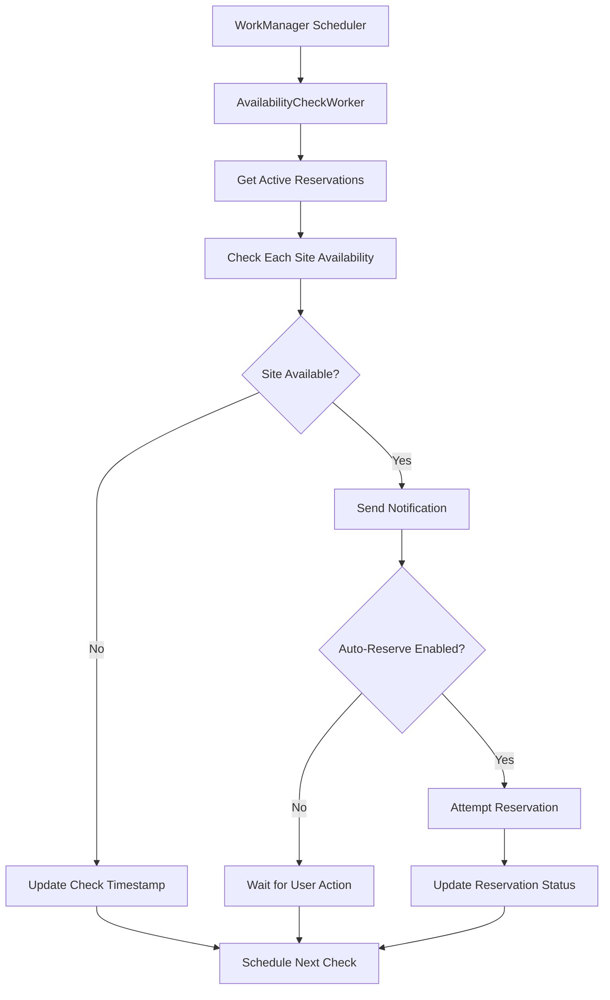

# API Integration Guide

## Overview

SiteBook integrates with multiple APIs to provide comprehensive campground reservation monitoring and booking capabilities. This document outlines the integration approach, API specifications, and implementation details.

## API Architecture

### Primary APIs

#### 1. Recreation.gov RIDB API
**Purpose**: Federal campground data and availability  
**Base URL**: `https://ridb.recreation.gov/api/v1/`  
**Authentication**: API Key required  
**Rate Limits**: 1000 requests per hour  

#### 2. SiteBook Backend API  
**Purpose**: User management, reservation automation, notifications  
**Base URL**: `https://api.sitebook.com/v1/`  
**Authentication**: JWT Bearer tokens  
**Rate Limits**: 10,000 requests per hour per user  

#### 3. ReserveAmerica API (Future)
**Purpose**: State park reservations  
**Base URL**: `https://api.reserveamerica.com/v1/`  
**Authentication**: OAuth 2.0  

## Recreation.gov Integration

### Getting API Access
1. Visit [RIDB API Documentation](https://ridb.recreation.gov/docs)
2. Register for free API key
3. Read usage guidelines and terms
4. Configure rate limiting in your application

### Key Endpoints

#### Facilities (Campgrounds)
```http
GET /facilities
Parameters:
- latitude, longitude, radius (for location search)  
- state (filter by state)
- activity (filter by activity type)
- limit, offset (pagination)
- apikey (required)
```

**Response Structure:**
```json
{
  "RECDATA": [
    {
      "FacilityID": "232447",
      "FacilityName": "Yellowstone National Park",
      "FacilityLatitude": 44.427963,
      "FacilityLongitude": -110.588455,
      "FacilityDescription": "America's first national park...",
      "FacilityPhone": "(307) 344-7381",
      "FacilityReservationURL": "https://www.recreation.gov/...",
      "ORGANIZATION": [...],
      "ACTIVITY": [...],
      "MEDIA": [...]
    }
  ],
  "METADATA": {
    "RESULTS": {
      "TOTAL_COUNT": 1,
      "CURRENT_COUNT": 1
    }
  }
}
```

#### Campsites
```http
GET /campsites
Parameters:
- facilityId (required)
- limit, offset (pagination)
- apikey (required)
```

#### Availability
```http
GET /availability/facility/{facilityId}/{year}/{month}
Parameters:
- facilityId (required)
- year (YYYY format)  
- month (MM format)
- apikey (required)
```

**Response Structure:**
```json
{
  "campsites": {
    "site_id": {
      "2024-03-15": {
        "status": "Available",
        "min_stay": 2,
        "max_stay": 14
      }
    }
  }
}
```

### Implementation Details

#### API Service Interface
```kotlin
interface RecreationGovService {
    @GET("facilities")
    suspend fun getFacilities(
        @Query("latitude") latitude: Double? = null,
        @Query("longitude") longitude: Double? = null,
        @Query("radius") radius: Double? = null,
        @Query("state") state: String? = null,
        @Query("limit") limit: Int = 50,
        @Query("offset") offset: Int = 0,
        @Query("apikey") apiKey: String
    ): Response<RecreationApiResponse<FacilityResponse>>
    
    // Additional endpoints...
}
```

#### Error Handling
```kotlin
sealed class ApiResult<T> {
    data class Success<T>(val data: T) : ApiResult<T>()
    data class Error<T>(
        val code: Int,
        val message: String,
        val exception: Exception? = null
    ) : ApiResult<T>()
    data class NetworkError<T>(val exception: Exception) : ApiResult<T>()
}
```

#### Rate Limiting
```kotlin
class RateLimitInterceptor : Interceptor {
    private val rateLimiter = RateLimiter.create(15.0) // 15 requests per minute
    
    override fun intercept(chain: Chain): Response {
        rateLimiter.acquire() // Blocks until permit available
        return chain.proceed(chain.request())
    }
}
```

## SiteBook Backend API

### Authentication Flow

#### Registration
```http
POST /auth/register
Content-Type: application/json

{
  "email": "user@example.com",
  "password": "securePassword123",
  "firstName": "John",
  "lastName": "Doe"
}
```

**Response:**
```json
{
  "token": "eyJhbGciOiJIUzI1NiIs...",
  "refreshToken": "def502004c1b7e9b...",
  "user": {
    "id": "user_123",
    "email": "user@example.com",
    "firstName": "John",
    "lastName": "Doe"
  },
  "expiresIn": 3600
}
```

#### Token Refresh
```http
POST /auth/refresh
Authorization: Bearer {refreshToken}
```

### Reservation Management

#### Create Reservation Request
```http
POST /reservations
Authorization: Bearer {accessToken}
Content-Type: application/json

{
  "campsiteId": "site_123",
  "checkInDate": "2024-07-15",
  "checkOutDate": "2024-07-18",
  "guestCount": 4,
  "autoReserve": true,
  "maxPrice": 150.00,
  "specialRequests": "Quiet site preferred"
}
```

#### Start Monitoring
```http
POST /monitoring/start
Authorization: Bearer {accessToken}
Content-Type: application/json

{
  "campsiteId": "site_123",
  "checkInDate": "2024-07-15",
  "checkOutDate": "2024-07-18",
  "autoReserve": false,
  "maxPrice": 100.00
}
```

### Webhooks and Notifications

#### Availability Webhook
```http
POST /webhooks/availability
Content-Type: application/json

{
  "reservationId": "res_123",
  "campsiteId": "site_123",
  "isAvailable": true,
  "availabilityDate": "2024-07-15",
  "price": 45.00,
  "checkedAt": "2024-03-15T10:30:00Z"
}
```

## Data Synchronization Strategy

### Cache-First Approach
1. **Local Database**: Primary data source for UI
2. **API Calls**: Refresh cache periodically
3. **Background Sync**: Update data without user interaction
4. **Conflict Resolution**: Last-write-wins for user data

### Sync Implementation
```kotlin
class CampgroundRepository {
    suspend fun refreshCampgrounds(): Result<List<Campground>> {
        return try {
            // 1. Fetch from API
            val apiResult = recreationService.getFacilities(apiKey = apiKey)
            
            if (apiResult.isSuccessful) {
                // 2. Transform API models to local entities
                val campgrounds = apiResult.body()?.data?.map { it.toCampground() }
                
                // 3. Update local database
                campgroundDao.insertCampgrounds(campgrounds)
                
                // 4. Return success
                Result.success(campgrounds)
            } else {
                Result.failure(ApiException(apiResult.code()))
            }
        } catch (e: Exception) {
            Result.failure(e)
        }
    }
}
```

## Background Monitoring

### Availability Checking Workflow


### Implementation
```kotlin
@HiltWorker
class AvailabilityCheckWorker @AssistedInject constructor(
    @Assisted context: Context,
    @Assisted params: WorkerParameters,
    private val repository: ReservationRepository
) : CoroutineWorker(context, params) {

    override suspend fun doWork(): Result {
        return try {
            val activeReservations = repository.getActiveMonitoringReservations()
            
            for (reservation in activeReservations) {
                checkAvailabilityForReservation(reservation)
            }
            
            Result.success()
        } catch (e: Exception) {
            if (runAttemptCount < 3) {
                Result.retry()
            } else {
                Result.failure()
            }
        }
    }
}
```

## Error Handling and Resilience

### Network Error Recovery
```kotlin
class NetworkErrorRecovery {
    suspend fun <T> withRetry(
        retries: Int = 3,
        delayMillis: Long = 1000,
        block: suspend () -> T
    ): T {
        repeat(retries) { attempt ->
            try {
                return block()
            } catch (e: IOException) {
                if (attempt == retries - 1) throw e
                delay(delayMillis * (attempt + 1))
            }
        }
        throw IllegalStateException("Should not reach here")
    }
}
```

### Circuit Breaker Pattern
```kotlin
class CircuitBreaker {
    private var state = CircuitState.CLOSED
    private var failureCount = 0
    private var lastFailureTime = 0L
    
    suspend fun <T> execute(block: suspend () -> T): T {
        when (state) {
            CircuitState.OPEN -> {
                if (shouldAttemptReset()) {
                    state = CircuitState.HALF_OPEN
                } else {
                    throw CircuitBreakerOpenException()
                }
            }
            CircuitState.HALF_OPEN,
            CircuitState.CLOSED -> {
                // Proceed with execution
            }
        }
        
        return try {
            val result = block()
            onSuccess()
            result
        } catch (e: Exception) {
            onFailure()
            throw e
        }
    }
}
```

## Testing API Integrations

### Mock API Responses
```kotlin
class FakeRecreationGovService : RecreationGovService {
    override suspend fun getFacilities(
        latitude: Double?,
        longitude: Double?,
        radius: Double?,
        state: String?,
        limit: Int,
        offset: Int,
        apiKey: String
    ): Response<RecreationApiResponse<FacilityResponse>> {
        return Response.success(
            RecreationApiResponse(
                data = listOf(createTestFacility()),
                metadata = ApiMetadata(
                    results = ResultsMetadata(totalCount = 1, currentCount = 1)
                )
            )
        )
    }
}
```

### Integration Tests
```kotlin
@Test
fun `test campground refresh from API`() = runTest {
    // Given
    val mockService = FakeRecreationGovService()
    val repository = CampgroundRepository(dao, mockService)
    
    // When
    val result = repository.refreshCampgroundsFromApi("test_api_key")
    
    // Then
    assertThat(result.isSuccess).isTrue()
    verify(dao).insertCampgrounds(any())
}
```

## Rate Limiting and Quotas

### Recreation.gov Limits
- **Hourly Limit**: 1,000 requests per API key
- **Daily Limit**: 10,000 requests per API key
- **Burst Limit**: 100 requests per minute

### Implementation Strategy
```kotlin
class ApiRateLimiter {
    private val permits = Semaphore(15) // 15 concurrent requests
    private val rateLimiter = RateLimiter.create(0.25) // 15 requests per minute
    
    suspend fun <T> execute(block: suspend () -> T): T {
        permits.withPermit {
            rateLimiter.acquire()
            return block()
        }
    }
}
```

## Security Considerations

### API Key Management
```kotlin
object ApiKeyManager {
    private const val API_KEY_PREF = "recreation_gov_api_key"
    
    fun getApiKey(context: Context): String? {
        return EncryptedSharedPreferences.create(
            "api_keys",
            masterKey,
            context,
            AES256_SIV,
            AES256_GCM
        ).getString(API_KEY_PREF, null)
    }
}
```

### Request Signing
```kotlin
class RequestSigningInterceptor : Interceptor {
    override fun intercept(chain: Chain): Response {
        val original = chain.request()
        val timestamp = System.currentTimeMillis()
        val signature = generateHMAC(original.url.toString(), timestamp)
        
        val signed = original.newBuilder()
            .addHeader("X-Timestamp", timestamp.toString())
            .addHeader("X-Signature", signature)
            .build()
            
        return chain.proceed(signed)
    }
}
```

## Monitoring and Analytics

### API Performance Metrics
- **Response Time**: Track API call latency
- **Success Rate**: Monitor API failure rates
- **Error Distribution**: Categorize error types
- **Rate Limit Usage**: Monitor quota consumption

### Implementation
```kotlin
class ApiMetricsCollector {
    fun recordApiCall(
        endpoint: String,
        responseTime: Long,
        statusCode: Int,
        success: Boolean
    ) {
        // Send metrics to Firebase Analytics
        FirebaseAnalytics.getInstance(context).logEvent("api_call") {
            param("endpoint", endpoint)
            param("response_time", responseTime)
            param("status_code", statusCode.toDouble())
            param("success", if (success) 1.0 else 0.0)
        }
    }
}
```

---

This API integration guide provides a comprehensive approach to integrating with external services while maintaining reliability, security, and performance.